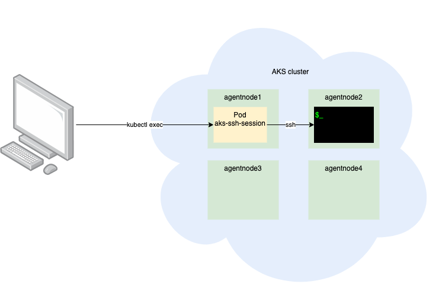

One of the great things about Kubernetes is that it abstracts away the underlying compute so that we only have to worry about our application workload running on the cluster. But there might be a chance that you need to connect directly to the underlying nodes in your Kubernetes cluster. If you manage your own cluster, that's most likely as easy as just SSH'ing into your nodes. But when working with a managed cluster, such as Azure Kubernetes Service (AKS), it could be more complicated than that.

The Microsoft docs illustrate [how to SSH into AKS nodes](https://docs.microsoft.com/en-us/azure/aks/ssh). One glance at that thorough documentation and you'll realize that this is not a trivial operation. In fact, it's quite long and tedious. Imagine having to do that more than once...

So instead of doing this manually, I decided to write a script to automate this process: [az-aks-ssh (GitHub)](https://github.com/trstringer/az-aks-ssh).

*Note: this script is current in alpha and should not be run in a production environment.*

*Note 2: this currently only supports virtual machine scale set agent node pools.*

The basic design of this process (whether manual or automated with the script) is that you create a pod in the AKS cluster and then `kubectl exec` into the pod, and then SSH into the desired agent node. I added a few "features" to this script. One of those is unique SSH key generation and usage by node. It's not a good idea to reuse SSH keys for multiple hosts/purposes, so this script takes care of that.

Here is a visual illustration on how this process works:



The usage of the script can be displayed by running it with no parameters:

```
$ ./az-aks-ssh.sh
Usage:
  SSH into an AKS agent node (pass in -c to run a single command
  or omit for an interactive session):
    ./az-aks-ssh.sh \
        -g|--resource-group <resource_group> \
        -n|--cluster-name <cluster> \
        -d|--node-name <node_name|any> \
        [-c|--command <command>] \
        [-o|--output-file <file>]

  Delete all locally generated SSH keys (~/.ssh/az_aks_*):
    ./az-aks-ssh.sh --clear-local-ssh-keys

  Delete the SSH proxy pod:
    ./az-aks-ssh.sh --delete-ssh-pod

  Cleanup SSH (delete SSH proxy pod and remove all keys):
    ./az-aks-ssh.sh --cleanup
```

You have the ability to run a non-interactive command into the AKS cluster node:

```
$ ./az-aks-ssh.sh \
    --resource-group thstringaks1 \
    --cluster-name thstringaks1 \
    --node-name any \
    --command "hostname"
```

You'll see similar output (as you can see below, this script is verbose by design so the user can see the process as it happens):

```
Selected 'any' node name, getting the first node
Using node: aks-nodepool1-36584864-vmss000000
Found VMSS(es):
aks-nodepool1-36584864-vmss
aks-nodepool2-36584864-vmss
Found aks-nodepool1-36584864-vmss000000 in aks-nodepool1-36584864-vmss
Key doesn't exist. Creating new key: /home/trstringer/.ssh/aks_ssh_aks-nodepool1-36584864-vmss000000
Instance ID is 0
Access extension does not exist or new key generated, adding to VM
Instance IP is 10.240.0.4
Error from server (NotFound): pods "aks-ssh-session" not found
Proxy pod doesn't exist, setting it up
pod/aks-ssh-session created
Waiting for proxy pod to be in a Running state
Waiting for proxy pod to be in a Running state

... apt output removed for brevity ...

Running command non-interactively
Warning: Permanently added '10.240.0.4' (ECDSA) to the list of known hosts.

Authorized uses only. All activity may be monitored and reported.
aks-nodepool1-36584864-vmss000000
```

You can see that the last line of the output is the command result (`hostname` in this case).

Likewise, you can run an interactive session by omitting the `--command` parameter:

```
$ ./az-aks-ssh.sh \
    --resource-group thstringaks1 \
    --cluster-name thstringaks1 \
    --node-name any
```

You will then be in an interactive SSH session with the AKS node:

```
Selected 'any' node name, getting the first node
Using node: aks-nodepool1-36584864-vmss000000
Found VMSS(es):
aks-nodepool1-36584864-vmss
aks-nodepool2-36584864-vmss
Found aks-nodepool1-36584864-vmss000000 in aks-nodepool1-36584864-vmss
Instance ID is 0
Access extension already exists
Instance IP is 10.240.0.4
NAME              READY   STATUS    RESTARTS   AGE
aks-ssh-session   1/1     Running   0          2m58s

... message of the day output removed for brevity ...

No command passed, running in interactive mode

Last login: Sun Apr 18 18:48:00 2021 from 10.240.0.7
To run a command as administrator (user "root"), use "sudo <command>".
See "man sudo_root" for details.

azureuser@aks-nodepool1-36584864-vmss000000:~$
```

Now you can see that I am in an SSH session with this agent node. Like always, run `exit` to leave the session.

One final note is that there are elements put in place to allow this process. Namely these are the generated SSH keys for connection to the nodes, as well as the `aks-ssh-session` proxy pod that is used. You can remove these items by passing `--cleanup` to the script:

```
$ ./az-aks-ssh --cleanup
Clearing local keys
Deleting SSH pod aks-ssh-session
pod "aks-ssh-session" deleted
```

Hopefully this script can make the task of SSH'ing into AKS nodes much simpler and automated for you as well!
