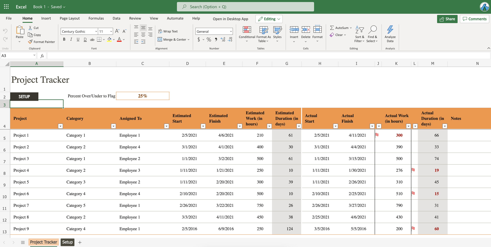
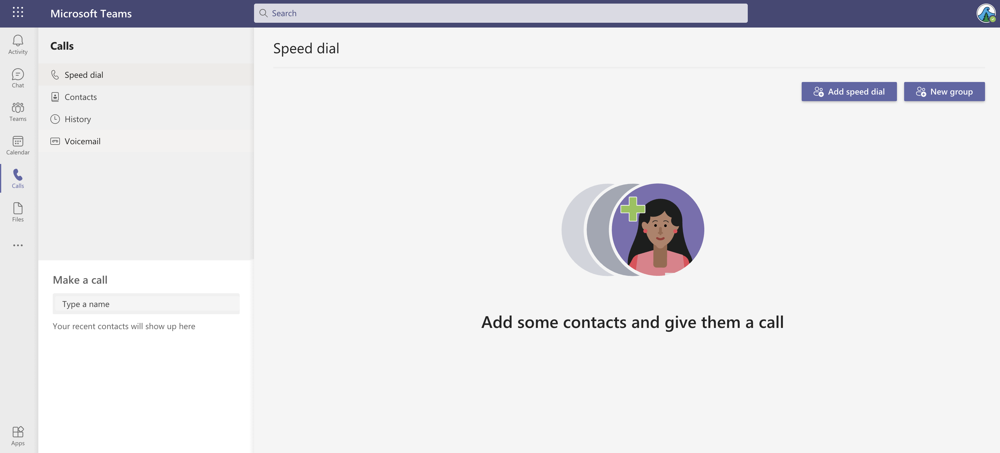

I hear this all the time, and I want to set the record straight: Just because you are part of a Microsoft "shop" (an organization or team that focuses heavily on Microsoft technologies, such as Azure) doesn't necessarily eliminate the possibility of using Linux as your local development machine.

I love Linux and everything about it: the experience, open source, and computing freedom that it provides. Here's what I hear all of the time:

> You use Azure? You have to use Windows/PowerShell/C#.

This is far from the truth. I think this mentality is surrounded by a lot of untruths. I want to use this space to talk about the ones that I hear the most, as well the actual reality that debunks these myths.

## Myth 1: You need Windows (or MacOS) to use Office

This is the one that I hear the most. You work in a company that uses the Office suite of tools, so you think you need Windows or MacOS to install. While this was true in the past, I can very confidently say that the web apps for Office tools (Outlook, Word, Excel, PowerPoint, etc.) have come a *long* way in the past few years. Simply put, they are quite capable and I have yet to say to myself *"I wish this feature was available in the web app version of [Office app name]"*.

As an example, this is Excel in my browser.



## Myth 2: Your company uses Teams so you need Windows (or MacOS)

Another one related to the first myth, but a little different. Some groups might not be using the Office suite, but they might have to use Teams to communicate with customers or other teams.

The desktop client is [available for Linux](https://docs.microsoft.com/en-us/microsoftteams/get-clients#linux), or if you prefer to not install *any* software you can just use [Teams right from your browser](https://docs.microsoft.com/en-us/microsoftteams/get-clients#web-client).



## Myth 3: If you work with Azure from the command-line you have to use PowerShell

Nope! I'm a heavy user of the terminal, and as a Linux user I'm living in Bash all day. And of course, working at Microsoft *on* Azure I am constantly interacting with the cloud from my terminal. The [Azure CLI](https://docs.microsoft.com/en-us/cli/azure/) is all you need for interacting with your Azure resources.

```
 $ az group create -l eastus -n trstringer1
{
  "id": "/subscriptions/.../resourceGroups/trstringer1",
  "location": "eastus",
  "managedBy": null,
  "name": "trstringer1",
  "properties": {
    "provisioningState": "Succeeded"
  },
  "tags": null,
  "type": "Microsoft.Resources/resourceGroups"
}
~
 $ az group list -o table
Name                      Location    Status
------------------------  ----------  ---------
NetworkWatcherRG          eastus2     Succeeded
DefaultResourceGroup-CUS  centralus   Succeeded
trstringer1               eastus      Succeeded
```

## Myth 4: You should use C#

This is an interesting one. Technically as a Linux user you could [use C#](https://docs.microsoft.com/en-us/dotnet/core/install/linux), but it is not the most common programming language (or .NET as the platform) for the Linux community. But what if you need to write software that interacts with Azure? There are many other non-.NET options!

My personal languages of preference are [Python](https://docs.microsoft.com/en-us/azure/developer/python/) and [Go](https://github.com/Azure/azure-sdk-for-go). But there are many other options, including [Java](https://azure.github.io/azure-sdk-for-java/).

So no, you don't have to use the Windows/Visual Studio/C# stack. You can just as easily use Linux/Vim/Python.

## Summary

Hopefully this blog post has highlighted (and disapproved) a handful of myths surround Linux on the desktop usage. It is an option, and a great one at that!
