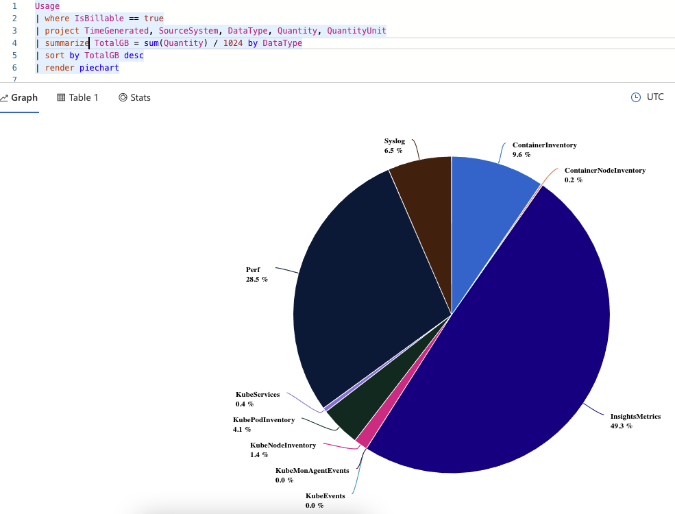
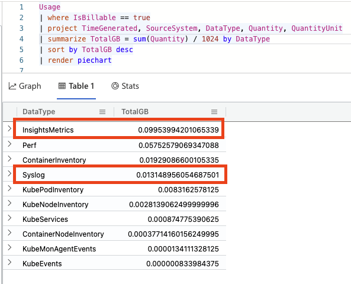
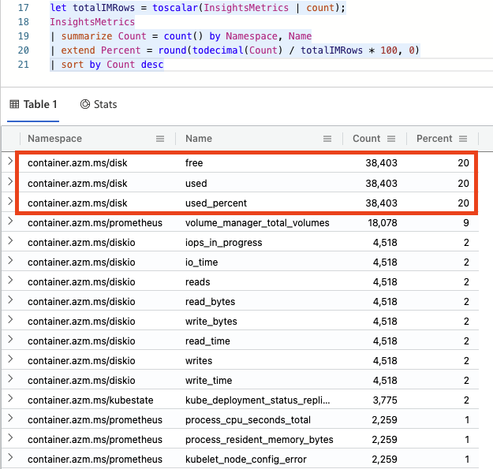
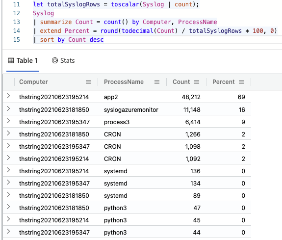

I see this comment a *lot*: "Azure Monitor is great **but it's really expensive**!" Like most things in the cloud, it is not free (well... it is if you are using less than 5 GB and storing your logs for less than 31 days). But also like most things that cost money you have a certain amount of control over this depending on how you use it.

This is a two part blog post to address this concern:

**Part 1 - Find Out Why (this blog post)**
- What costs money in Log Analytics?
- What is taking up all the data in my workspace?
- How can I find the root sources?

**Part 2 - Save Some Money (*coming soon...*)**

In this first part, I'll talk about how to figure out *why* your Log Analytics workspace(s) is(are) so expensive. We'll dive into how to get that granular information. Then in the next post, part 2, I will talk about how to save some money.

*Note: With that being said, I'd also like to state that the nature of logging, monitoring, and observability are operational costs that are hard to measure monetarily over many variables, but are necessary and wise investments (example: No logging of course is $0 for cloud services but the amount you pay in poor customer satisfaction, long resolution times, and exhausted engineers is more than most can afford).*

## What exactly costs money?

Cloud providers spend a lot of time trying to explain what costs how much for a service, but it is a challenge. Microsoft, I think, does a pretty good job at making it easy to understand how much certain things cost. With [Azure Monitor pricing](https://azure.microsoft.com/en-us/pricing/details/monitor/), you can evaluate and estimate how much your logging solution can end up being.

For Azure Monitor Log Analytics, you are charged based on two things:

- How much data you ingest
- How long you retain your data

*Note: All prices explained are from East US. Other regions' prices may vary.*

Let's first talk about **data retention**. There is no cost for data retention up to 31 days. But beyond 31 days, you will pay $0.10 per GB per month.

**Data ingestion** has two different pricing models:

- Pay-as-you-go, which is $2.30	per GB
- Commitment tiers

Commitment tiers are a way to estimate how much you will need, and then pay a fixed price for anything from 100 GB per day, to 5,000 GB per day. The really great thing about commitment tiers is that you can save quite a bit of money as opposed to the pay-as-you-go pricing.

## What are my current workspaces' SKU and data retention?

Now that you know what costs money, it's a good idea to know what your existing workspace(s) is(are):

```
$ az monitor log-analytics workspace show \
    --resource-group rg1 \
    --workspace-name workspace1 \
    --query "{retentionInDays:retentionInDays,sku:sku}"
```

This will tell you the data retention as well as pricing model that you have for a particular workspace.

## What is costing so much money?

Now that we know that data retention and data ingestion are the two main factors for cost, let's focus on the latter: How can you find out how much data is in your workspace's tables? Here's a good KQL query you can use to find that information:

```
Usage
| where IsBillable == true
| project TimeGenerated, SourceSystem, DataType, Quantity, QuantityUnit
| summarize TotalGB = sum(Quantity) / 1024 by DataType
| sort by TotalGB desc
| render piechart
```

This query will pull the aggregated usage (you could add a `where TimeGenerated > ago(30d)` to match your data retention specification, or whatever that is set to for your workspace) and group based on `DataType`, which from my experience directly correlates to a table name (I haven't seen an example yet where this is not the case, but if you know of one please reach out to me!). Here is the output from one of my workspaces:



It's pretty obvious from this chart what is happening, but to see a table view with more exact numbers, just click on the table view:



With this query I can see that the `InsightsMetrics` table is taking up about half of my consumption for this workspace! No matter how obvious things appear, it is now time to start analyzing these individual components. What seems right? What seems excessive? etc. At this point, it is **very situation and workload dependent on how to troubleshoot further**. Most likely your data distribution in your workspace is very different than my sample one.

Let's step through a couple of examples though to show a general approach to this exercise.

For my example, let's take the `InsightsMetrics` table. I always like to pull 10 rows to see what the data looks like:

```
InsightsMetrics
| take 10
```

This helps me "understand the data". Now I can see that for `InsightsMetrics` we care about the `Namespace` and the metric `Name`. So I might be curious which metrics are consuming the most space:

```
let totalIMRows = toscalar(InsightsMetrics | count);
InsightsMetrics
| summarize Count = count() by Namespace, Name
| extend Percent = round(todecimal(Count) / totalIMRows * 100, 0)
| sort by Count desc
```

And I can see the result of this query:



It looks like, in my case, that the disk metrics are taking up 60% of this table. This is just some basic monitoring running on an idling AKS cluster for about a half of a day, but in reality you'll want to analyze a situation like this and start asking the questions:

- Should I be logging this so frequently?
- Should I be logging this against so many targets?
- Should I be logging this *at all*?

Only you can answer these questions for your particular logging and workload. And most likely it won't be the `InsightsMetrics` table consuming the most for you.

But continuing with the exercise, even though the `Syslog` table is not the #2 consumer of data, it might be higher on that list than expected. So let's dig into this one (again, first doing a `Syslog | take 10` KQL query to see what the data looks like). In this case, I'm curious what computers and processes are causing the consumption:

```
let totalSyslogRows = toscalar(Syslog | count);
Syslog
| summarize Count = count() by Computer, ProcessName
| extend Percent = round(todecimal(Count) / totalSyslogRows * 100, 0)
| sort by Count desc
```

And looking at the output of this query:



Great info! In my contrived scenario, it looks like `app2` on this computer is taking up almost 70% of the rows for this table. If this `Syslog` table is larger than expected, I'd say that's a good starting point.

## Summary

This blog post started out explaining *what* costs money in Azure Monitor Log Analytics. We transitioned into looking at how to figure out some specifics in your own workspaces so you can diagnose and investigate actual data. Then I took a few examples with `InsightsMetrics` and `Syslog` to illustrate a couple of ad hoc ways of drilling down into the data to understand the consumption. I hope this helps! Next blog post we'll look at how to save some money with Log Analytics.
